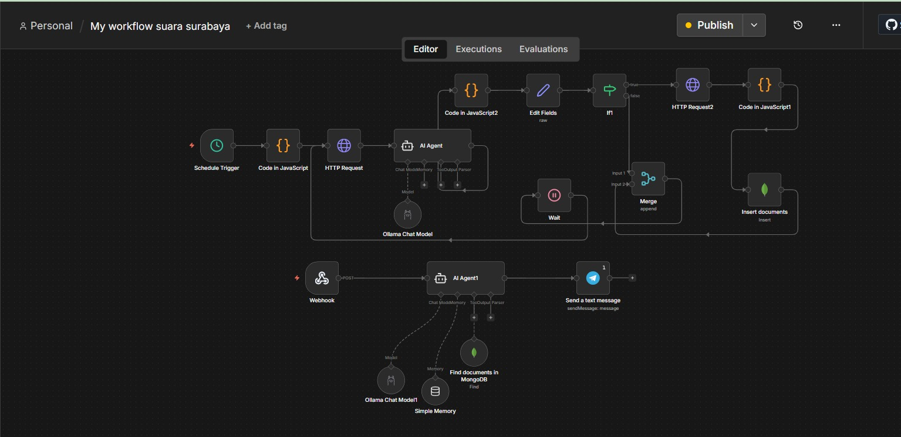

# Laporan Project Akhir Big Data: Data Kecelakaan dan Kebakaran di Jawa Timur Sumber Suara Surabaya

## Pendahuluan
Project ini adalah sistem **Pipeline Big Data dan Monitoring Berita** yang dirancang untuk melakukan *scraping* data berita secara real-time dari platform Facebook (halaman E100). Sistem ini mengintegrasikan pemrosesan teks berbasis AI untuk memfilter relevansi berita, penentuan lokasi geografis otomatis (*geocoding*), penyimpanan data ke database NoSQL **MongoDB**, serta layanan bot Telegram sebagai sarana penyampaian informasi kepada pengguna.

Sistem ini dirancang untuk memetakan informasi kejadian darurat secara cepat dan akurat, membantu pengambilan keputusan berdasarkan data yang terstruktur.


---
## PPT Presentasi 
[Klik di Sini untuk Melihat PPT](https://canva.link/24y6uuwyeux3rt5)
---

---
## Workflow N8N Analisis Sentimen Publik Terhadap Kenaikan Harga BBM Pada Platform Youtube
---



## 🛠 Arsitektur Sistem

Sistem bekerja melalui dua alur utama yang dihubungkan menggunakan `ngrok` untuk aksesibilitas *webhook* ke n8n:

### 1. Workflow Scraper & Ingestion (Jadwal Otomatis)
Alur ini memastikan data berita terbaru selalu ter-update dan tersimpan dengan benar:
* **Schedule Trigger**: Pemicu waktu untuk menjalankan proses secara berkala.
* **Scraper (Python + Selenium via WebSocket)**: Mengambil data dari Facebook. Menggunakan metode **Remote Debugging (Port 9222)**, skrip menempel (*attach*) pada satu *instance* browser Chrome yang sudah *authenticated*. Hal ini memastikan sesi login Facebook terjaga secara permanen tanpa perlu login ulang.
* **AI Agent (Ollama)**: Menganalisis konten berita untuk memastikan relevansi (kebakaran, kecelakaan, dll).
* **Geocoding (HTTP Request 2)**: Mengirimkan teks lokasi berita ke **Google Maps API** untuk mendapatkan koordinat titik lokasi yang presisi.
* **Data Filter (If Node)**: Melakukan seleksi ketat. Hanya data yang memiliki informasi lokasi valid yang diteruskan ke database, mencegah data kosong/tidak relevan masuk.
* **MongoDB**: Penyimpanan data yang sudah lengkap (berita + koordinat) ke koleksi database.

### 2. Workflow Bot Telegram (Webhook) - Interaksi Berkelanjutan
Bot ini berfungsi sebagai asisten cerdas yang aktif kapan saja dibutuhkan:
* **Webhook (via ngrok)**: Menghubungkan *endpoint* n8n ke jaringan publik untuk menerima pesan dari user secara *real-time*.
* **AI Agent & Memory (Core Bot)**: Berbeda dengan *scraper* yang terjadwal, AI Agent pada bot ini **selalu aktif merespons** input user. Menggunakan **Simple Memory**, AI mengingat konteks percakapan sebelumnya. Jika user bertanya tentang lokasi kebakaran, AI secara otomatis melakukan *query* ke **MongoDB** untuk mencari data spesifik dari *database* yang sudah diolah.
* **Telegram Bot**: Menjadi saluran komunikasi dua arah. Bot tidak hanya mengirim notifikasi berita baru, tetapi juga berfungsi sebagai pusat pencarian informasi (*Knowledge Assistant*) bagi user melalui interaksi percakapan.

---

## 📋 Struktur Data
Data yang diproses memiliki skema berikut:
* `post_id`: ID unik untuk setiap postingan.
* `title`: Judul ringkas berita.
* `content`: Isi teks berita yang telah dibersihkan oleh fungsi `clean_fb_text`.
* `link`: Tautan asli postingan Facebook.
* `date`: Waktu postingan/kejadian.
* `location_data`: Hasil respons koordinat dari Google Maps API.
* `is_valid`: Status validasi dari *If node*.

---

## Teknologi dan Dependencies

| Kategori | Teknologi | Fungsi / Peran dalam Proyek |
| :--- | :--- | :--- |
| **Automation & Scraper**| **Python, Selenium, Flask** | Mengontrol browser via WebSocket (port 9222) untuk *scraping* dinamis. |
| **Database NoSQL** | **MongoDB** | Database NoSQL utama untuk menampung dokumen berita dan koordinat. |
| **Automation Orchestrator**| **n8n** | *Core engine* yang menjalankan alur kerja AI, geocoding, dan webhook bot. |
| **Environment Control** | **Docker Compose** | Orkestrasi container terisolasi untuk MongoDB, n8n, dan service terkait. |

---

## Alur Kerja Scraper (`scraper_ss.py`)

Proyek ini menerapkan *automated data pipeline* dinamis menggunakan Selenium WebDriver yang dibungkus ke dalam microservice Flask API (`/scrape`).

### 1. Mekanisme Ekstraksi (Facebook Scraper)
* **WebSocket Connection**: Menggunakan `debuggerAddress` pada port 9222 untuk menempel ke sesi Chrome yang sudah login, menghilangkan kebutuhan untuk proses *login* berulang yang berisiko terdeteksi oleh Facebook.
* **Dynamic Scrolling**: Browser virtual melakukan eksekusi `window.scrollBy(0, 1500)` secara berkala untuk memicu *lazy loading* konten di timeline E100.
* **Data Parsing**: Menggunakan XPATH untuk menangkap kontainer artikel, membersihkan teks dengan *regex* (`clean_fb_text`), serta memfilter berita menggunakan daftar kata kunci relevan.

### 2. Output Data Payload (JSON API)
Data dikirimkan ke n8n dalam format JSON, lengkap dengan metadata waktu dan identitas unik postingan agar sistem dapat melakukan cek duplikasi melalui `scraped_links.txt`.

---

## Cara Instalasi dan Eksekusi

### 1. Jalankan Stack Environment (Docker)
Nyalakan service database dan n8n:
```bash
docker compose up -d
```

### 2. Jalankan Scraper
Pastikan browser Chrome berjalan di port 9222, kemudian jalankan skrip Python:

```bash
pip install flask selenium webdriver-manager
python scraper_ss.py
```

### 3. Jalankan Ngrok (Tunneling)
Untuk menghubungkan n8n ke jaringan publik agar webhook dapat menerima data, jalankan perintah berikut di terminal:

```bash
.\ngrok http 5679 --url=even-caring-unheard.ngrok-free.dev
```

### 4. Eksekusi Workflow n8n
* Pastikan URL ngrok (`even-caring-unheard.ngrok-free.dev`) telah dikonfigurasi pada webhook n8n Anda.
* Aktifkan *Schedule Trigger* pada workflow n8n untuk mulai menjalankan siklus pengambilan data, geocoding, dan penyimpanan ke MongoDB.

---

## Limitasi Proyek
* **Stabilitas Browser**: Bergantung penuh pada instance Chrome manual yang berjalan di port 9222; jika proses tersebut mati, sesi login harus diulang.
* **Kuota API**: Penggunaan Google Maps API untuk geocoding memiliki batasan kuota harian yang perlu dimonitor.
* **Struktur DOM**: *Scraping* sangat bergantung pada struktur HTML Facebook; perubahan desain pada situs E100 dapat memerlukan pembaruan pada XPATH di skrip.

## Kesimpulan
Proyek ini berhasil membangun *pipeline* otomasi yang efisien dengan menggabungkan keunggulan sesi *browser persistent* (WebSocket) untuk *data ingestion*, n8n sebagai *orchestrator* cerdas yang aktif merespons pengguna melalui bot Telegram, serta integrasi *geocoding* real-time. Sistem ini mampu mengubah data sosial media yang tidak terstruktur menjadi informasi geografis yang bermakna dalam database, serta menyediakan akses instan bagi user sebagai *Knowledge Assistant*.
